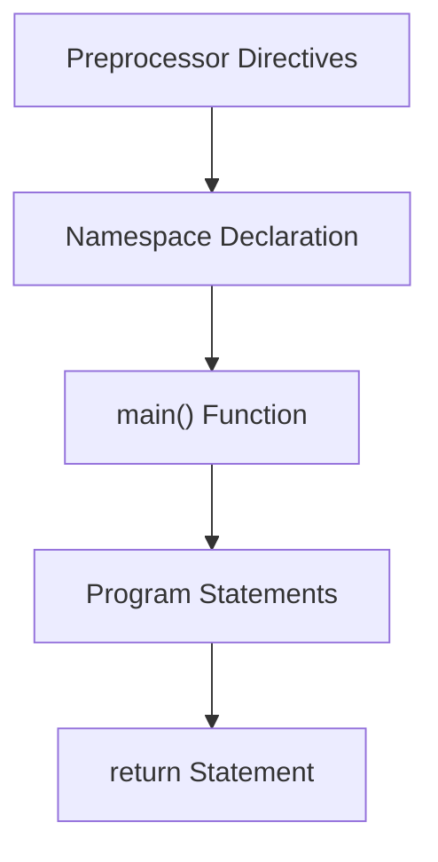
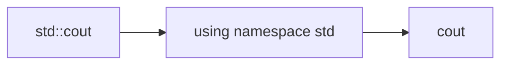
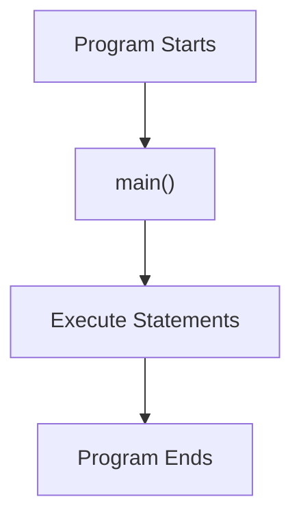
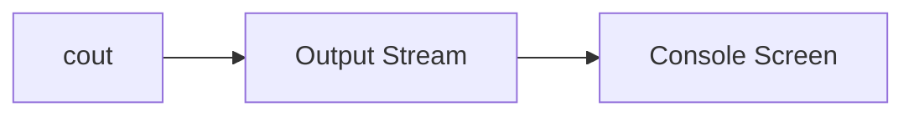
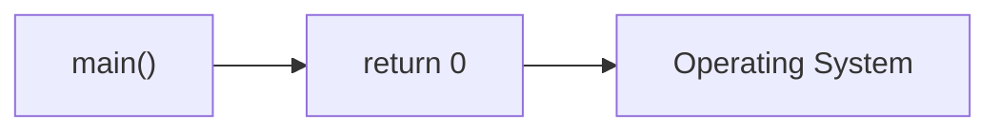
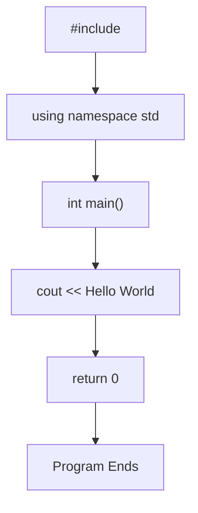
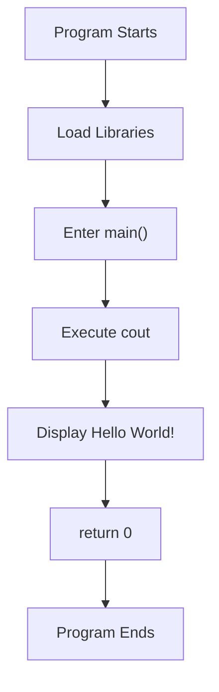

# Basic Structure of a C++ Program

A beginner-friendly guide to understanding the fundamental structure of every C++ program.

---

# 📌 Introduction

Every C++ program follows a basic structure.

No matter how large or complex the application becomes, it is built using the same foundational components.

Let's start with a simple program:

```cpp
#include <iostream>
using namespace std;

int main() {
    cout << "Hello World!";
    return 0;
}
```

---

# 🔥 Program Structure Overview



---

# 📄 Complete Program

```cpp
#include <iostream>
using namespace std;

int main() {
    cout << "Hello World!";
    return 0;
}
```

---

# 1️⃣ Header Files

```cpp
#include <iostream>
```

The `#include` directive tells the compiler to include the contents of a header file.

---

# What is a Header File?

A header file contains:

- Function declarations
- Class declarations
- Library definitions
- Constants

---

# 🔄 Header Inclusion Flow


---

# Why Do We Need iostream?

The `iostream` library provides:

- `cout`
- `cin`
- `cerr`

Without including it:

```cpp
cout << "Hello";
```

would produce a compilation error.

---

# 2️⃣ Namespace Declaration

```cpp
using namespace std;
```

---

# What is a Namespace?

A namespace is used to organize code and avoid naming conflicts.

The C++ Standard Library places its features inside the `std` namespace.

---

# Without Namespace

```cpp
std::cout << "Hello";
```

---

# With Namespace

```cpp
using namespace std;

cout << "Hello";
```

---

# 🔄 Namespace Flow



---

# Why Does std Exist?

Imagine two libraries both have a function called:

```cpp
print()
```

Namespaces prevent naming collisions.

---

# 3️⃣ main() Function

```cpp
int main()
```

The `main()` function is the entry point of every C++ executable program.

Execution always starts from here.

---

# 🔄 Program Execution Flow



---

# Function Breakdown

```cpp
int main()
```

| Part | Meaning |
|--------|----------|
| int | Returns an integer value |
| main | Entry point function |
| () | Function parameters |

---

# Why is main Mandatory?

Without `main()`:

```cpp
cout << "Hello";
```

The compiler cannot determine where execution should start.

---

# 4️⃣ Output Statement

```cpp
cout << "Hello World!";
```

---

# What is cout?

`cout` stands for:

```text
Character Output
```

It is used to display output on the screen.

---

# Example

```cpp
cout << "Hello World!";
```

Output:

```text
Hello World!
```

---

# 🔄 Output Flow



---

# What Does << Mean?

The `<<` operator is called the:

```text
Stream Insertion Operator
```

It inserts data into the output stream.

---

# Example

```cpp
cout << "Hello";
```

means:

```text
Send "Hello" to the screen
```

---

# Multiple Outputs

```cpp
cout << "Hello ";
cout << "World!";
```

Output:

```text
Hello World!
```

---

# Chained Output

```cpp
cout << "Hello " << "World!";
```

Output:

```text
Hello World!
```

---

# 5️⃣ return Statement

```cpp
return 0;
```

The return statement ends the function and returns control back to the operating system.

---

# Why Return 0?

Conventionally:

```cpp
return 0;
```

means:

```text
Program executed successfully
```

---

# Return Values

| Value | Meaning |
|---------|----------|
| 0 | Success |
| Non-zero | Error/Failure |

---

# 🔄 Return Flow



---

# Complete Program Breakdown

```cpp
#include <iostream>      // Header File

using namespace std;     // Namespace

int main()               // Entry Point
{
    cout << "Hello World!"; // Output

    return 0;            // Exit Status
}
```

---

# 🔥 Visual Representation



---

# 📌 Execution Flow

When you run the program:



---

# 🧠 Important Interview Concepts

| Concept | Description |
|----------|-------------|
| `#include` | Includes library/header file |
| `iostream` | Provides input/output functionality |
| `using namespace std` | Removes need for `std::` prefix |
| `main()` | Program entry point |
| `cout` | Standard output object |
| `<<` | Stream insertion operator |
| `return 0` | Indicates successful execution |

---

# ❌ Common Beginner Mistakes

### Missing Semicolon

```cpp
cout << "Hello"
```

Error:

```text
expected ';'
```

---

### Missing Header

```cpp
cout << "Hello";
```

without:

```cpp
#include <iostream>
```

Error:

```text
cout was not declared
```

---

### Missing Namespace

```cpp
cout << "Hello";
```

without:

```cpp
using namespace std;
```

Error:

```text
cout was not declared in this scope
```

---

# ✅ Final Summary

Every basic C++ program consists of:

```text
Header Files
      ↓
Namespace
      ↓
main() Function
      ↓
Statements
      ↓
return 0
```

Understanding this structure is the first step toward learning:

- Functions
- Variables
- Loops
- Classes
- Object-Oriented Programming
- Data Structures and Algorithms

---

# ⭐ Happy Coding
