# Complete C++ Compilation Process: Beginner-Friendly End-to-End Guide

This guide explains, in simple language, how C++ code becomes a running program.

If you are new to C++, follow this order first:

1. Read sections 1, 2, 3, 4.
2. Read section 13 (hands-on commands).
3. Read sections 5 to 9 once again with the flowchart.
4. Use section 16 for interview practice by level.

### 60-Second Version (For Absolute Beginners)

When you write C++ code, your computer cannot run it directly.

So tools convert it step by step:

```text
.cpp/.h files -> preprocess -> compile -> assemble -> link -> executable -> run
```

Think of it like this:

- You write English-like code.
- Compiler tools translate it into machine instructions.
- OS loads and runs the final program.

It covers:

- Source code and header files
- Preprocessing
- Compilation
- Assembly
- Linking
- Execution
- Internal compiler pipeline
- Memory layout
- GCC architecture and commands
- Build systems (Make and CMake)
- Interview questions by difficulty level

---

## 1. What Is the C++ Compilation Process?

Computers do not understand C++ source code directly. They execute machine instructions (binary).

So C++ code is converted through multiple stages:

```text
Source Code -> Preprocessing -> Compilation -> Assembly -> Linking -> Executable -> Execution
```

---

## 2. Overall Compilation Flow

Tip for beginners: memorize only this flow first. Most compiler errors can be understood by knowing which stage failed.

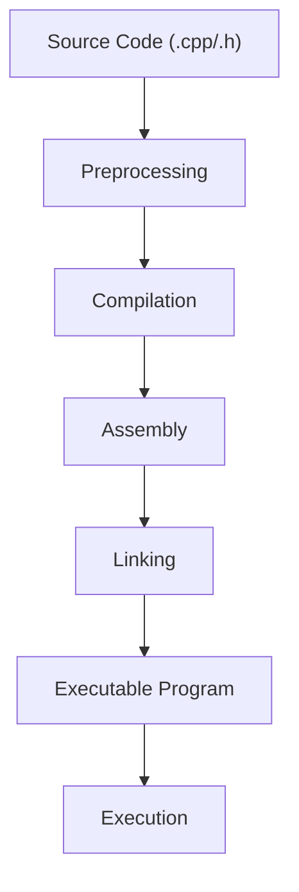

---

## 3. Source Code Stage

In simple words:

- `.h` files tell what exists.
- `.cpp` files show how it works.

C++ projects commonly use:

| File Type     | Purpose                             |
| ------------- | ----------------------------------- |
| `.h` / `.hpp` | Declarations, interfaces, templates |
| `.cpp`        | Definitions, implementation logic   |

### Basic Project Structure

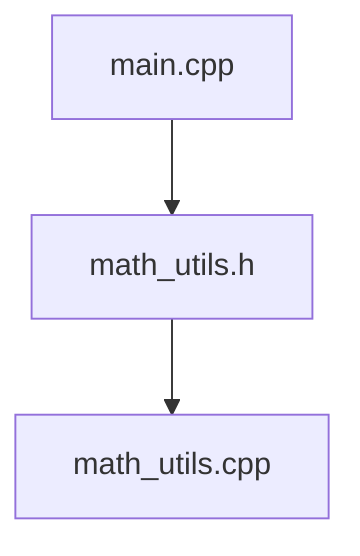

### Example Project

#### main.cpp

```cpp
#include <iostream>
#include "math_utils.h"

int main() {
    int result = add(10, 5);
    std::cout << result << "\n";
    return 0;
}
```

#### math_utils.h

```cpp
int add(int a, int b);
```

Declaration tells the compiler: "this function exists somewhere."

#### math_utils.cpp

```cpp
int add(int a, int b) {
    return a + b;
}
```

Definition gives the actual code for that function.

### Declaration vs Definition


### Why Separate Header and Source Files?

| Benefit            | Explanation                                     |
| ------------------ | ----------------------------------------------- |
| Reusability        | One header can be included in many source files |
| Organization       | Cleaner and modular code                        |
| Faster rebuilds    | Only changed translation units are rebuilt      |
| Team collaboration | Developers can work on separate files           |

---

## 4. Program Entry Point

Simple idea: every C++ program starts from `main()`.

Every executable starts from:

```cpp
int main()
```

Program flow:

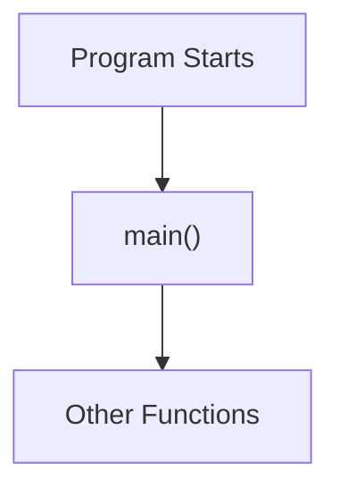

---

## 5. Preprocessing Stage

Simple idea: preprocessing is a text-edit step before real compilation starts.

Preprocessor handles lines beginning with `#` before real compilation.

Typical directives:

- `#include`
- `#define`
- `#ifdef`, `#ifndef`, `#endif`

### Preprocessing Flow

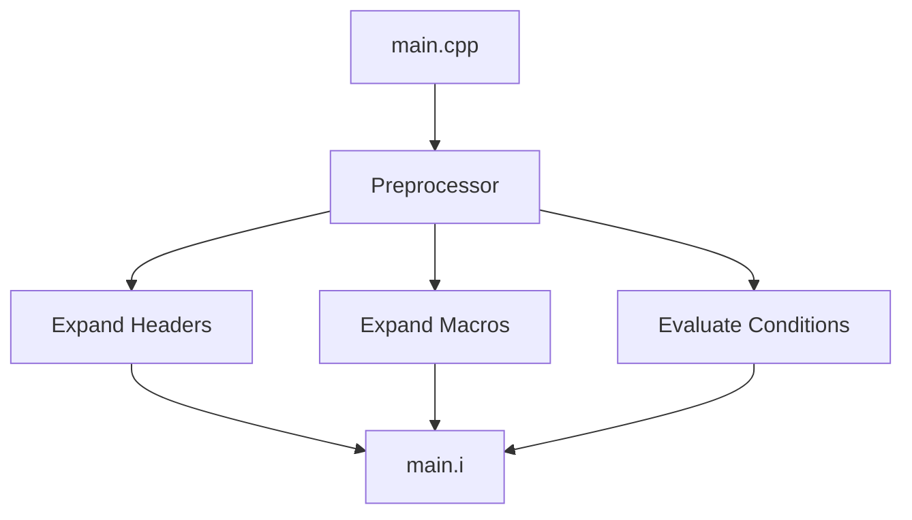

### Responsibilities (Easy View)

| Task                    | What It Does                          |
| ----------------------- | ------------------------------------- |
| Header inclusion        | Pastes included file contents         |
| Macro expansion         | Replaces macro names with values/text |
| Conditional compilation | Includes/excludes code by conditions  |

### Header Inclusion Example

```cpp
#include <iostream>
```

Conceptually:

```text
Before: #include <iostream>
After : iostream content is inserted into your source
```

### Macro Expansion Example

```cpp
#define PI 3.14
float area = PI * r * r;
```

After preprocessing:

```cpp
float area = 3.14f * r * r;
```

### Conditional Compilation Example

```cpp
#ifdef DEBUG
std::cout << "Debug mode\n";
#endif
```

Flow:

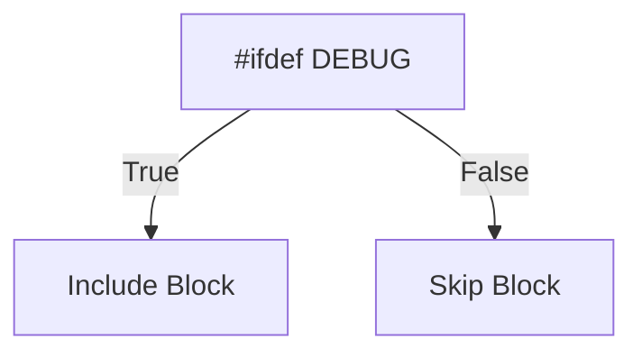

### Header Guards

Used to avoid including the same header multiple times in one `.cpp` file.

```cpp
#ifndef MATH_UTILS_H
#define MATH_UTILS_H

int add(int a, int b);

#endif
```

Guard logic:

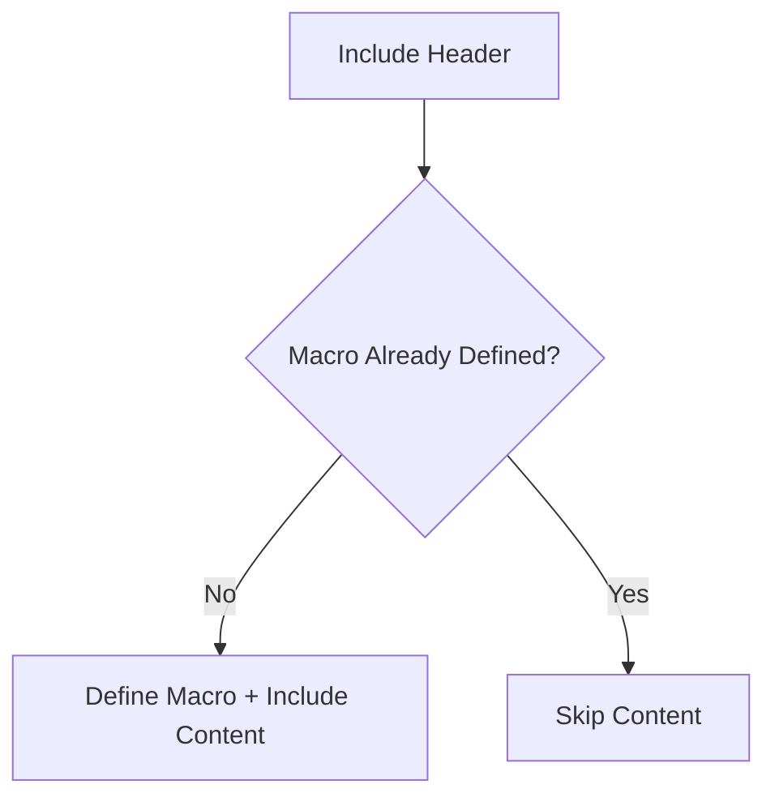

Preprocessor output file is usually:

```text
main.i
```

---

## 6. Compilation Stage

Simple idea: the compiler checks your code and converts it to assembly.

Compiler takes preprocessed source (`.i`) and produces assembly (`.s`).

### Compiler Responsibilities (Beginner View)

```text
1) Syntax checking
2) Type checking
3) Semantic analysis
4) Optimization
5) Generate assembly code
```

### Compilation Flow

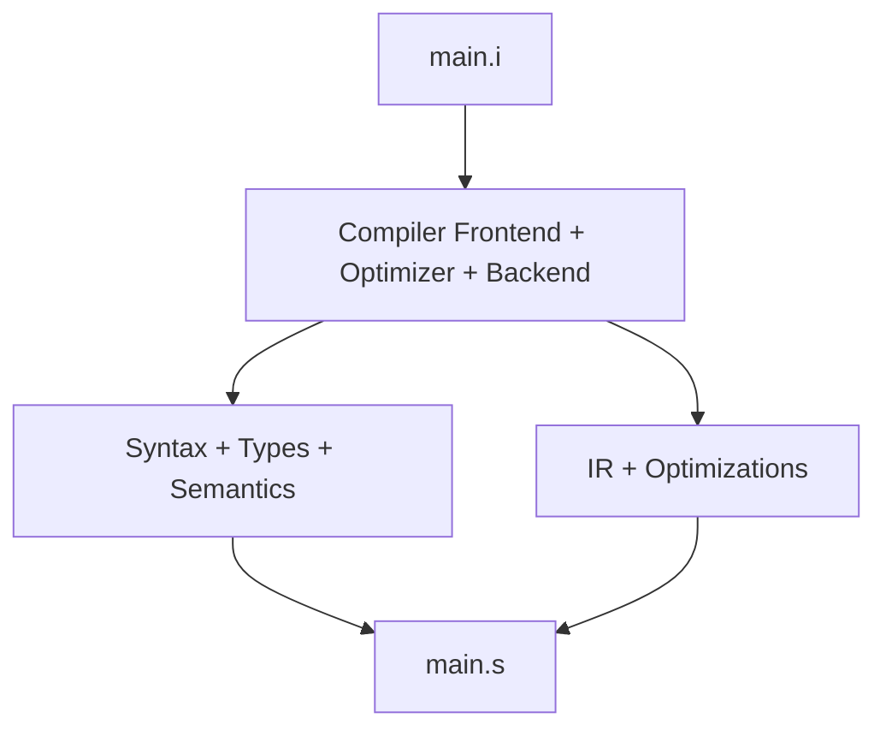

### Common Compile-Time Checks (What beginners usually see)

Syntax error:

```cpp
int main() {
    std::cout << "Hello"
}
```

Typical message:

```text
error: expected ';'
```

Type error:

```cpp
int x = "Hello";
```

Typical message:

```text
error: invalid conversion from 'const char*' to 'int'
```

Semantic error:

```cpp
x = 10;
```

Typical message:

```text
error: 'x' was not declared in this scope
```

Optimization example:

```cpp
int x = 5 * 10;
```

Can be folded to:

```cpp
int x = 50;
```

---

## 7. Assembly Stage

Simple idea: assembler converts assembly text into machine-level object code.

Compiler-generated assembly is converted to object code.

C++:

```cpp
int sum = a + b;
```

Assembly-like form:

```asm
mov eax, a
add eax, b
mov sum, eax
```

Assembler output:

```text
main.o
```

Flow:

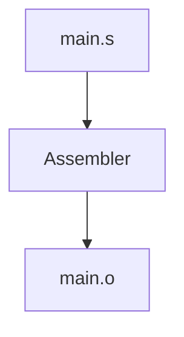

Object file generally contains:

- Machine code sections
- Symbol table
- Relocation entries (address-fix information)
- Debug metadata (optional)

### Multi-file Compilation

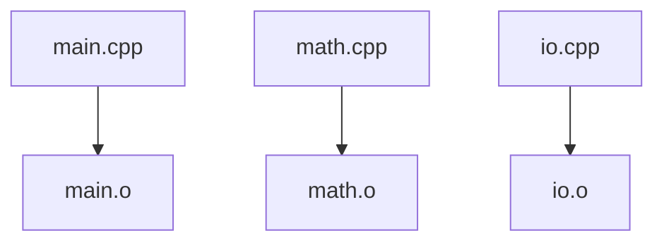

---

## 8. Linking Stage

Simple idea: linker joins all `.o` files and libraries into one final program.

Linker combines object files and libraries into a final executable.

### Linking Flow

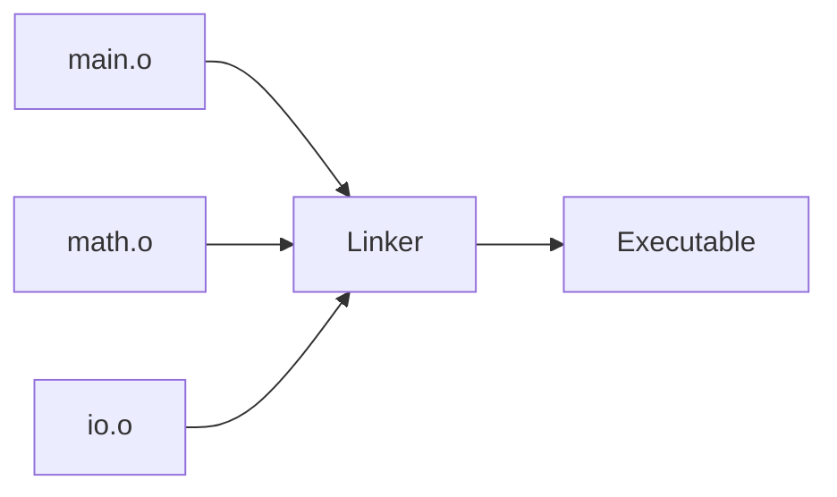

### Linker Responsibilities (Easy Words)

```text
1) Combine code from object files
2) Match function/variable uses to real definitions
3) Add library code (static or dynamic)
4) Fix final addresses
5) Produce executable file
```

Symbol resolution example:

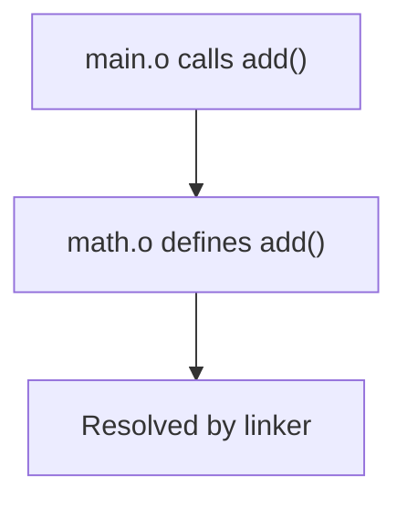

### Static vs Dynamic Linking

| Type    | Description                         | Tradeoff                                    |
| ------- | ----------------------------------- | ------------------------------------------- |
| Static  | Library code copied into executable | Larger binary, fewer runtime deps           |
| Dynamic | Library loaded at runtime           | Smaller binary, runtime dependency required |

---

## 9. Execution Stage

Simple idea: the OS loads your executable into memory and starts `main()`.

After linking, the OS loader runs the executable.

### Execution Flow

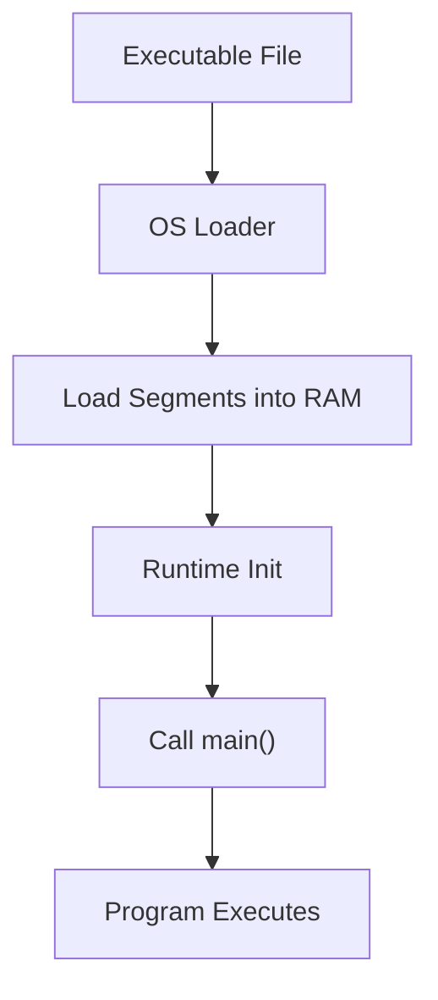

---

## 10. Process Memory Layout (Typical)

Beginner note:

- Stack: local variables, function calls.
- Heap: memory you request manually (`new`, `malloc`).
- Data/BSS: global and static variables.
- Text: machine instructions of your program.

```text
High Address
+---------------------------+
| Stack (local vars, calls) |
+---------------------------+
| Heap (dynamic allocation) |
+---------------------------+
| BSS (zero-initialized)    |
+---------------------------+
| Data (initialized globals)|
+---------------------------+
| Text (code)               |
+---------------------------+
Low Address
```

Notes:

- Stack usually grows downward.
- Heap usually grows upward.
- Exact layout is platform dependent.

---

## 11. Internal Compiler Pipeline

This section is slightly advanced. If you are a beginner, first focus on sections 1 to 9 and come back here.

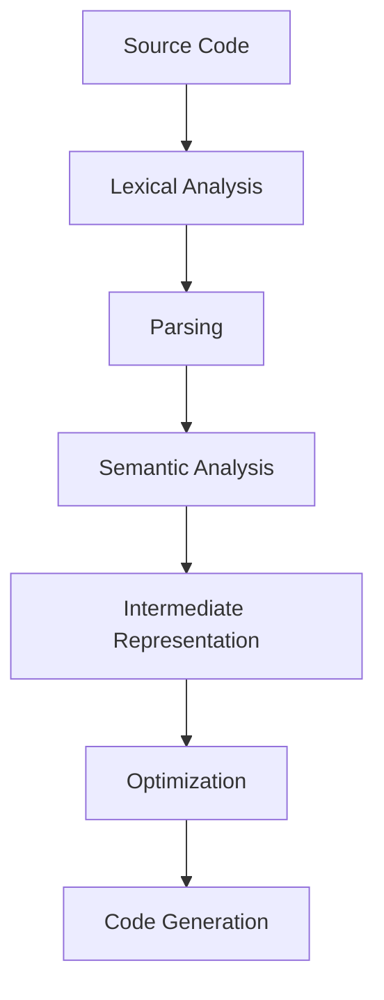

### Lexical Analysis

Turns characters into tokens.

```cpp
int x = 10;
```

Tokens:

```text
int | x | = | 10 | ;
```

### Parsing and AST

Parser checks grammar and builds an AST.

AST means Abstract Syntax Tree: a tree representation of your code structure.

```text
    =
    / \
    x   +
    / \
    a   b
```

### Optimization Techniques

| Optimization                     | Meaning                                       |
| -------------------------------- | --------------------------------------------- |
| Constant folding                 | Evaluate constant expressions at compile time |
| Dead code elimination            | Remove code that has no effect                |
| Inlining                         | Replace call overhead with function body      |
| Common subexpression elimination | Reuse repeated computations                   |
| Loop optimizations               | Improve loop performance                      |

---

## 12. GCC / G++ Architecture

Simple idea: `g++` is a driver that runs multiple tools for each stage.

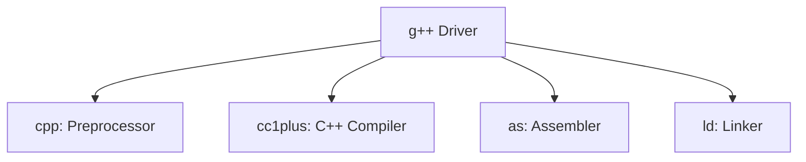

### Useful g++ Commands

| Command                              | Purpose             |
| ------------------------------------ | ------------------- |
| `g++ -E main.cpp -o main.i`          | Only preprocessing  |
| `g++ -S main.i -o main.s`            | Compile to assembly |
| `g++ -c main.s -o main.o`            | Assemble to object  |
| `g++ main.o math_utils.o -o app`     | Link to executable  |
| `g++ main.cpp math_utils.cpp -o app` | One-step full build |

---

## 13. End-to-End Hands-on Pipeline

Assume files: `main.cpp`, `math_utils.cpp`, `math_utils.h`

Beginner tip: you usually run a single command (`g++ main.cpp math_utils.cpp -o app`), but learning stage-wise commands helps debugging.

```bash
# 1) Preprocess
g++ -E main.cpp -o main.i

# 2) Compile to assembly
g++ -S main.i -o main.s

# 3) Assemble to object file
g++ -c main.s -o main.o

# 4) Compile second source directly to object
g++ -c math_utils.cpp -o math_utils.o

# 5) Link objects into executable
g++ main.o math_utils.o -o app

# 6) Run executable
./app
```

### Complete Build Graph

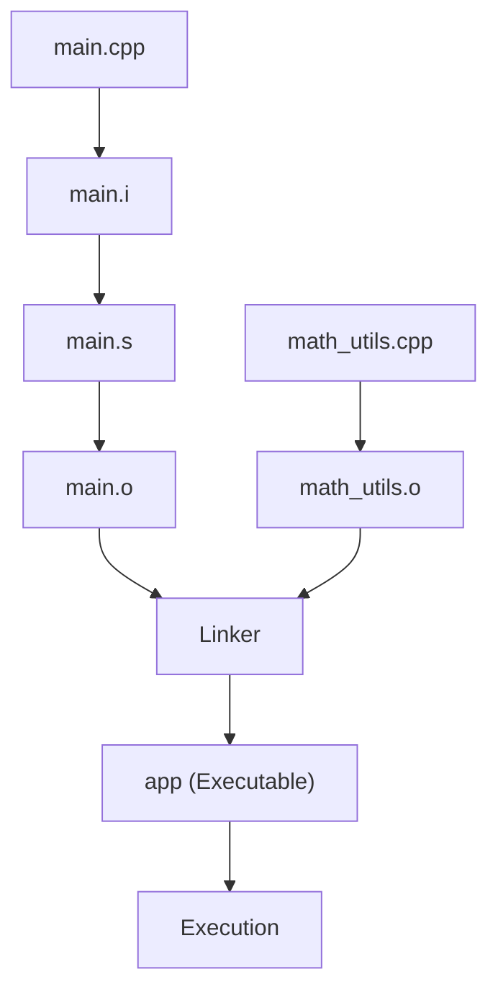

---

## 14. Build Systems

Simple idea: build systems save time by rebuilding only what changed.

### Makefile

Useful for incremental builds (compile only changed files).

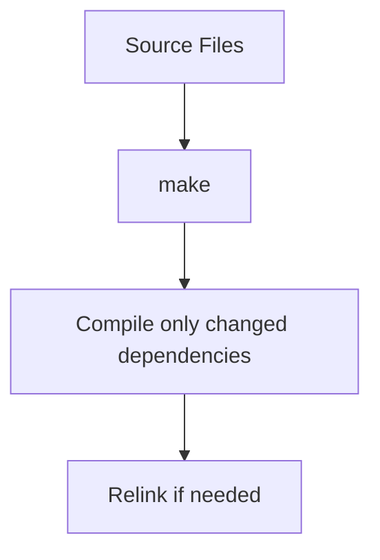

Example:

```makefile
app: main.o math_utils.o
    g++ main.o math_utils.o -o app

main.o: main.cpp math_utils.h
    g++ -c main.cpp -o main.o

math_utils.o: math_utils.cpp math_utils.h
    g++ -c math_utils.cpp -o math_utils.o

clean:
    rm -f *.o app
```

### CMake

Cross-platform build generator.

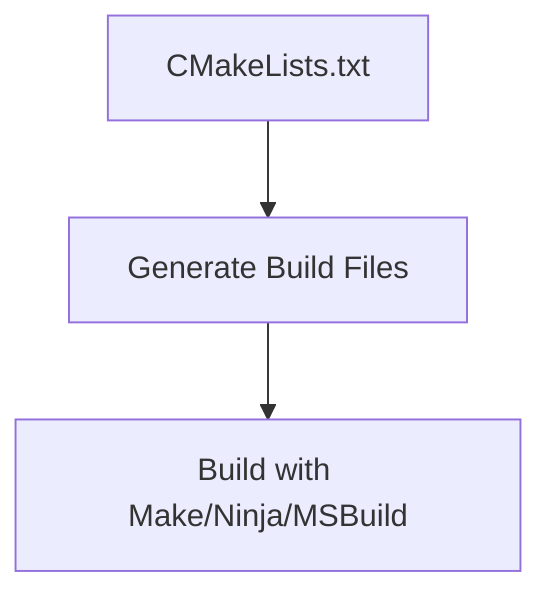

Minimal example:

```cmake
cmake_minimum_required(VERSION 3.16)
project(CppCompilationDemo)

add_executable(app main.cpp math_utils.cpp)
```

---

## 15. Error Pipeline and Debug Thinking

Beginner debug rule:

- If error mentions missing header or `#include`, think preprocessing.
- If error mentions syntax/type, think compilation.
- If error says "undefined reference", think linking.
- If program crashes while running, think execution/runtime.

### Stage-wise Common Errors

| Stage         | Typical Error             | Example                                              |
| ------------- | ------------------------- | ---------------------------------------------------- |
| Preprocessing | Missing include           | `fatal error: myheader.h: No such file or directory` |
| Compilation   | Syntax/type error         | Missing semicolon, invalid conversion                |
| Assembly      | Arch/instruction mismatch | Rare in normal C++ workflow                          |
| Linking       | Undefined reference       | Declared function, missing definition/object         |
| Execution     | Runtime crash             | Segmentation fault, invalid memory access            |

### Error Pipeline Diagram

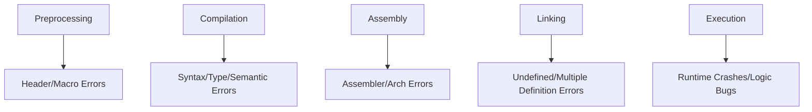

---

## 16. Interview Preparation by Difficulty Level

Use this way as a beginner:

1. Master Very Easy and Easy first.
2. Move to Medium once commands are clear.
3. Treat Hard/Very Hard as advanced topics.

## Very Easy Level

1. What is the purpose of compilation?
2. What is the role of `main()`?
3. Difference between `.h` and `.cpp`?
4. What does `#include` do?

Expected short answers:

- Compilation converts C++ source to machine-executable form.
- `main()` is the program entry point.
- Header: declaration/interface. Source: implementation.
- `#include` pastes header content during preprocessing.

## Easy Level

1. What are preprocessing, compilation, assembly, and linking?
2. What is a header guard and why is it needed?
3. What is an object file?
4. What is an undefined reference?

Expected points:

- Stages and each input/output extension (`.i`, `.s`, `.o`, executable).
- Header guards prevent duplicate declarations from multiple inclusion.
- Object file has machine code plus symbols and relocation metadata.
- Undefined reference means declaration exists but linker cannot find definition.

## Medium Level

1. Compiler vs linker: clear difference?
2. Static linking vs dynamic linking?
3. Why are separate compilation and incremental builds useful?
4. How does symbol resolution work across files?

Expected points:

- Compiler translates each translation unit; linker resolves cross-unit symbols.
- Static embeds library code; dynamic resolves at runtime.
- Faster rebuilds by recompiling only changed units.
- Linker matches undefined symbols to global symbol definitions.

## Hard Level

1. Explain lexical analysis, parsing, AST, semantic analysis, and IR.
2. Describe common optimization passes and when they help.
3. Explain relocation in linking.
4. How do ABI and name mangling impact linking in C++?

Expected points:

- Frontend creates semantically valid IR from tokens and syntax tree.
- Optimizations trade compile time vs runtime performance.
- Relocation patches addresses after section layout.
- ABI and mangled symbols must match across compiler/toolchain boundaries.

## Very Hard Level

1. How can ODR violations appear, and how do you fix them?
2. Compare PIC/PIE and their relationship to dynamic linking.
3. Explain LTO and cross-module optimization benefits/costs.
4. How does startup code initialize runtime before `main()`?
5. How can mismatch in compiler flags create subtle link/runtime bugs?

Expected points:

- ODR violations occur from multiple conflicting definitions.
- PIC/PIE enable address-independent code for shared libs/executables.
- LTO enables whole-program optimization but increases build complexity/time.
- CRT startup runs global constructors and runtime setup before `main()`.
- Inconsistent flags (ABI, exceptions, RTTI, stdlib) can break compatibility.

---

## 17. Quick Revision Sheet

```text
Human-readable C++
    -> Preprocessing (.i)
    -> Compilation (.s)
    -> Assembly (.o)
    -> Linking (executable)
    -> Execution (OS loader + runtime)
```

## 17.1 Tiny Glossary (Beginner Friendly)

| Term               | Simple Meaning                                       |
| ------------------ | ---------------------------------------------------- |
| Translation unit   | Final source file after includes/macros are expanded |
| Symbol             | Name of a function/variable used by linker           |
| Object file (`.o`) | Partially built machine code file                    |
| Executable         | Final runnable program                               |
| Runtime            | What happens while program is actually running       |

---

## 18. Final Master Flowchart

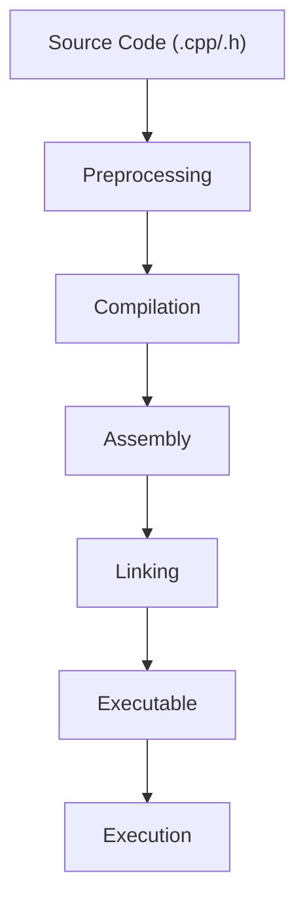

---

## 19. Final Summary

C++ compilation is a pipeline that converts human-readable source code into machine-executable binaries.

Core stages:

```text
Preprocessing -> Compilation -> Assembly -> Linking -> Execution
```

Mastering this helps with:

- Debugging build and linker issues
- Writing modular and maintainable code
- Improving compile/runtime performance
- Cracking interview questions from beginner to advanced
